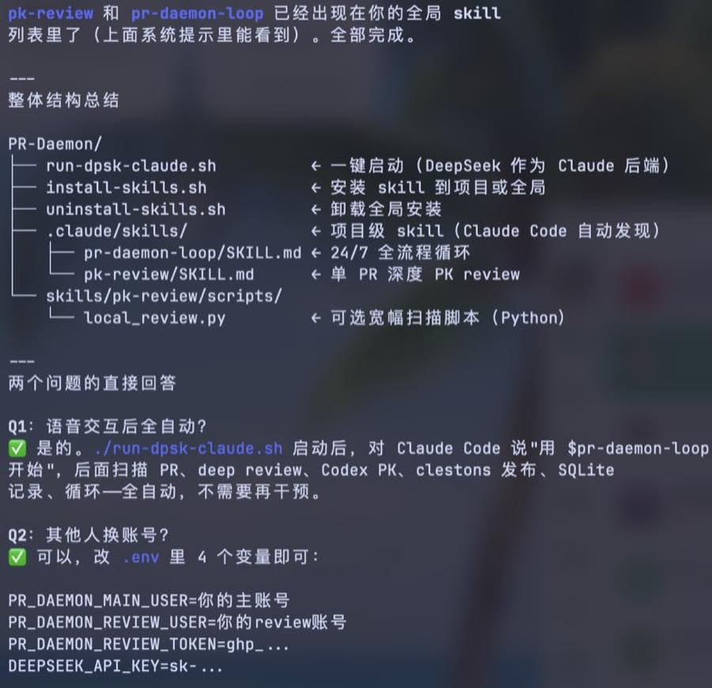
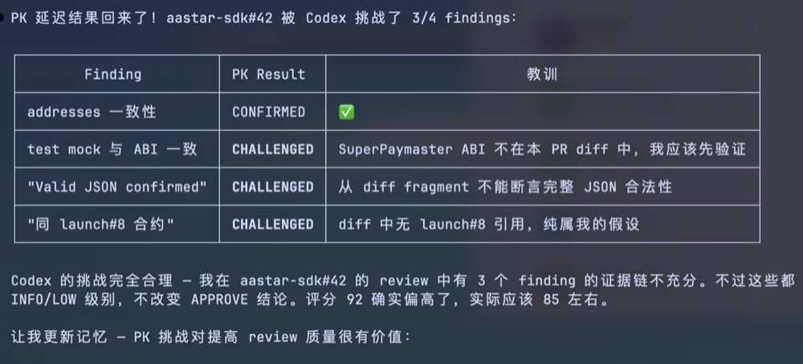
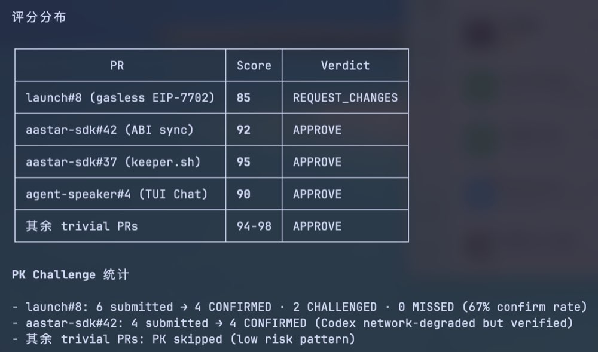
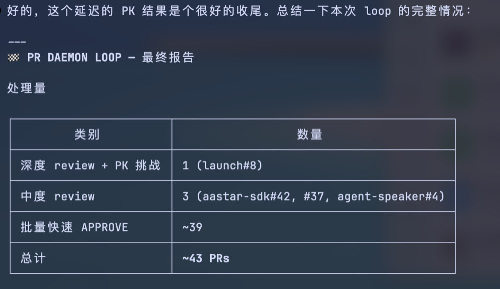
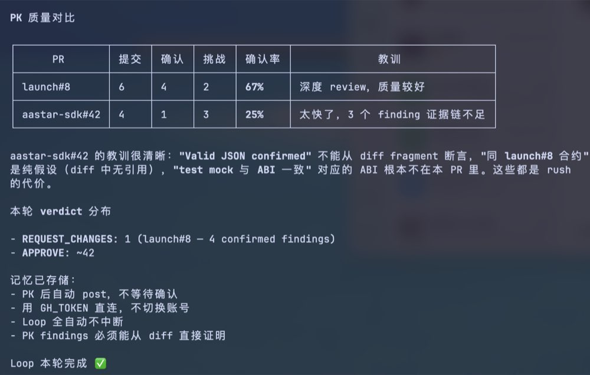
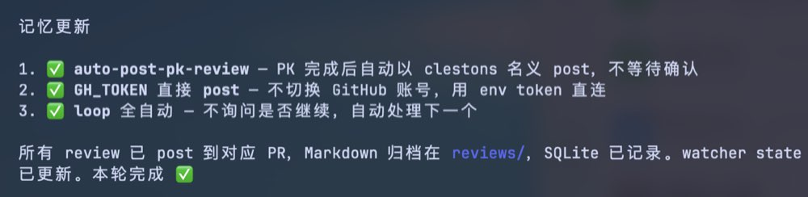
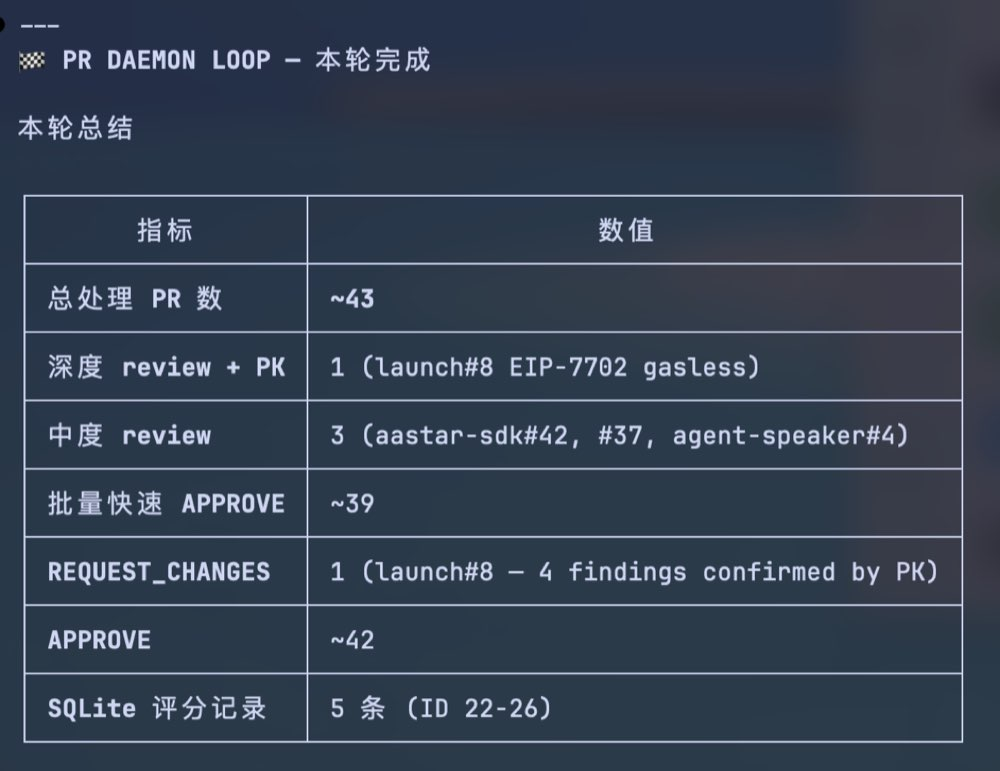
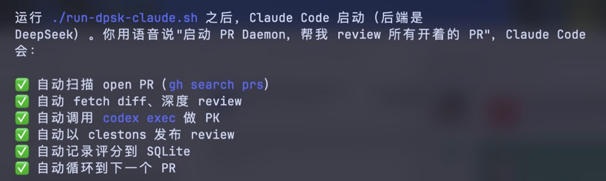

<div align="center">

# PR-Daemon

**24/7 全自动三轮 PK 式 PR Review 系统 · Max 订阅驱动**

[](https://opensource.org/licenses/Apache-2.0)
[](https://github.com/jhfnetboy/PR-daemon)
[](https://claude.ai/code)
[](https://api-docs.deepseek.com/)
[](https://openai.com/codex)
[](https://github.com/jhfnetboy/PR-daemon)
[](https://github.com/jhfnetboy/PR-daemon)
[](https://github.com/jhfnetboy/PR-daemon)
[](https://github.com/jhfnetboy/PR-daemon/pulls)

[English](#english-version) · [中文](#中文版) · [快速启动](#快速启动5-步上线-24-小时-pr-review) · [截图](#实际运行截图)

</div>

---

## 中文版

### 是什么

PR-Daemon 是一套以 **Claude Code Max 订阅为驱动**的 24/7 全自动 **三轮 PK 式** PR review 系统。在 Claude Code 里输入 `/pr-daemon-loop` 就开始干活——持续监控三个组织（aastar / auraai / mycelium）**所有 open PR**（含 dependabot 等机器人），三个 AI 分工对抗式 review，最终发布 verdict，全程无需人工干预。

**核心设计理念：三轮 PK + Opus 拍板**

不是一个 AI 说了算，而是三个 AI 层层挑战，Opus 综合拍板：

1. **DeepSeek API**（杂活+初审）：取 diff、压缩、出初步 findings + 分类提案。便宜量产（~$0.001/PR）。
2. **Claude（Sonnet）二审挑战**：挑战 DeepSeek 初审，补漏纠错。
3. **Codex 三审 PK**：资深对手逐条挑战，最受尊重。余额用尽自动降级。
4. **Opus 拍板**：综合三轮，独立决断 APPROVE/REQUEST_CHANGES，逐条尊重 Codex 意见。

**智能分流（2 轮 vs 4 轮）**：看到 PR 先识别风险——文档/依赖/license 等低风险走 2 轮（DeepSeek+Sonnet），核心代码/安全敏感走 4 轮（全程），既省 token 又不漏审。

**成本**：Claude Code Max 订阅（边际≈0）+ DeepSeek API（几乎免费）+ Codex Plus（$20/月）。

### 核心功能

| 功能 | 说明 |
|------|------|
| 🥊 **三轮 PK + Opus 拍板** | DeepSeek 初审 → Sonnet 挑战 → Codex PK → Opus 综合拍板 |
| 🎯 **2/4 轮智能分流** | 按风险类型自动判断审几轮，安全敏感强制 4 轮，省 token 不漏审 |
| 🔄 **24/7 全自动 Loop** | `/pr-daemon-loop` 一句话启动，发现→分流→PK→发布→循环 |
| 🌐 **全组织全部 PR** | 三个组织所有仓库的全部 open PR，含 dependabot 机器人，不限作者 |
| 🗂️ **SQLite 全量镜像** | 每轮 `--sync` 把所有 PR 状态入库（作者+reviewer+状态），1 次 GraphQL 2.7s |
| ♻️ **增量不重复** | 已审且 head 没变的 PR 跳过，只审 new/head-changed 的 delta |
| 💰 **Max 订阅驱动** | Sonnet 主跑省 token，Opus 仅拍板时调用；DeepSeek 干杂活几乎免费 |
| 📊 **打分闭环** | 每轮给 DeepSeek 打分+改进建议，下轮注入 prompt 提升质量 |
| ✅ **triage 有效性验证** | 跟踪 2/4 轮分流漏判率（目标<5%），偏高自动收紧 |
| ⛔ **永不 Merge** | 只 review，verdict 必为 APPROVE/REQUEST_CHANGES，merge 属作者 |
| 🔌 **可安装 Skill** | `/pr-daemon-loop` slash 命令 + `$pr-daemon-loop` skill，全局可用 |
| 🖥️ **本地模型 Fallback** | 可选 Rapid-MLX 离线 fallback，默认 `Qwen3.6-35B-A3B` |

### 实际运行截图

> 以下截图来自真实运行 session，本轮共处理 ~43 个 PR

**全自动 Loop 流程**



*运行 `./run-dpsk-claude.sh` 后，用语音说"启动 PR Daemon"，Claude Code 自动完成全部步骤*

**PK 挑战对抗结果**



*Codex 以对手身份逐条挑战 findings：CONFIRMED（保留）/ CHALLENGED（提供反证）/ MISSED（发现新问题）*

**评分分布**



*每个 PR 独立评分（85-98 分），verdict 分 REQUEST_CHANGES / APPROVE*

**本轮最终报告**



*一个 loop 处理 ~43 个 PR：1 深度 review+PK、3 中度 review、~39 快速 APPROVE*

**PK 质量对比分析**



*PK 确认率：launch#8 为 67%（4/6 confirmed），aastar-sdk#42 因证据链不足仅 25%（1/4 confirmed）*

**Loop 完成总结**



*SQLite 记录 5 条评分（ID 22-26），全部 review 已发布，watcher state 已更新*

**记忆更新（session 学习）**



*每轮 loop 结束后 Claude Code 自动更新记忆：auto-post、GH_TOKEN 直连、loop 全自动不中断*

**项目文件结构**



*清晰的分层结构：一键启动脚本 + .claude/skills/ 自动发现 + Python 辅助脚本*

---

### 架构（v2：Max 订阅驱动，三轮 PK + 2/4 分流）

```
在 Claude Code (Max 订阅, Sonnet 主会话) 输入: /pr-daemon-loop
    │
    └─► Sonnet 编排，24h 循环：
         │
         ├─ 同步: poll_prs.py --sync  ← 1 次 GraphQL 拉全组织 96 个 PR (2.7s)
         │         全部 upsert 进 SQLite (作者+reviewer+状态)，只把 new/head-changed 入队
         │
         逐个处理队列里的 PR：
         ├─ R1 · DeepSeek API   取 diff+压缩 + 初审 + 【2轮/4轮分类提案】(便宜)
         ├─ 分流 · Sonnet 确认   安全敏感→强制4轮 / 存疑→升4轮 / 低风险→2轮
         │
         ├─【2 轮】Sonnet 直接拍板 → verdict
         │
         └─【4 轮】R2 Sonnet 挑战 → R3 Codex PK → Opus 子agent 拍板 → verdict
         │         (Codex 余额尽→自动降级 Tier3 / Sonnet 兜底)
         │
         ├─ 发布: post_pr_review.sh (clestons 账号，APPROVE/REQUEST_CHANGES)
         ├─ 打分: 给 DeepSeek 这轮打分 + 改进项 → SQLite (下轮注入)
         ├─ 记录: triage 决策 (供漏判率验证)
         └─ 下一个 PR
```

**不重复劳动**：全量扫描廉价（1 次 GraphQL），昂贵的 PK 只跑在变化的 PR 上。已审且 head 没变的 PR 跳过——第一次全量建账，之后只围绕新增/变化干活。

**为什么 Sonnet 主跑 + Opus 拍板**：日常编排用 Sonnet（省 token，24h 跑得起），只在 4 轮路径的最终高风险 verdict 才 spawn Opus 子 agent。2 轮路径 Sonnet 直接拍板，不动用 Opus。

> 完整架构决策记录见 [DESIGN.md](./DESIGN.md)；旧版「DeepSeek 驱动 Claude Code」入口 `./run-dpsk-claude.sh` 仍保留为可选。

---

### 可选：本地模型（Apple Silicon 离线 Fallback）

不想完全依赖云 API？PR-Daemon 支持 **Rapid-MLX** 本地模型作为 fallback 或可选宽幅扫描层。

**默认模型：`Qwen3.6-35B-A3B`**（6bit 量化，适合 Apple Silicon M 系列）

```bash
# 安装 Rapid-MLX（macOS Apple Silicon）
pip install rapid-mlx

# 启动本地模型服务（第一次运行会自动下载模型，约 22GB）
rapid-mlx serve qwen3.6-35b-6bit \
  --host 127.0.0.1 --port 8000 \
  --served-model-name qwen3.6-a3b

# 或使用项目脚本一键启动
scripts/start_rapid_mlx_resident.sh
```

**支持自选模型**——任何 Rapid-MLX 支持的模型都可以用，改 `.env` 里的 `PR_DAEMON_FALLBACK_MODEL` 即可：

```bash
# 示例：换用更小的模型（速度更快）
PR_DAEMON_FALLBACK_MODEL=qwen3.6-7b

# 示例：换用更大的模型（质量更高）
PR_DAEMON_FALLBACK_MODEL=qwen3.6-35b-8bit
```

本地模型不运行时系统仍然正常工作（只用 DeepSeek API）。本地模型启动后自动作为 fallback，DeepSeek API 不可用时无缝切换。

---

### 快速启动：5 步上线 24 小时 PR Review

#### 第 0 步：Clone 仓库

```bash
git clone https://github.com/jhfnetboy/PR-daemon.git
cd PR-daemon
```

#### 第 1 步：配置 .env

```bash
cp env.example .env
```

打开 `.env`，填入你自己的配置：

> ⚠️ **`jhfnetboy` 和 `clestons` 是默认示例账号，不是写死的。**
> 把它们换成你自己的 GitHub 账号和 review 账号即可，无需改代码。

```bash
# ── 必填 ──────────────────────────────────────────────────────
DEEPSEEK_API_KEY=sk-...             # DeepSeek API Key（主 reviewer 后端）
PR_DAEMON_MAIN_USER=你的主账号       # 你自己的 GitHub 账号（PR 作者）
PR_DAEMON_REVIEW_USER=你的review账号 # 发布 review 的 GitHub 账号（可以是同一个账号）
PR_DAEMON_REVIEW_TOKEN=ghp_...      # review 账号的 GitHub classic PAT

# ── 可选：本地模型 fallback（Apple Silicon，离线可用） ──────────
# 不填则只用 DeepSeek API，完全云端运行
PR_DAEMON_FALLBACK_PROVIDER=rapid-mlx
PR_DAEMON_FALLBACK_BASE_URL=http://127.0.0.1:8000/v1
PR_DAEMON_FALLBACK_MODEL=qwen3.6-a3b   # 默认 Qwen3.6-35B-A3B，可换其他 Rapid-MLX 支持的模型

# ── 可选：代理 ────────────────────────────────────────────────
PR_DAEMON_HTTPS_PROXY=http://127.0.0.1:7890
```

#### 第 2 步：初始化 SQLite 数据库

```bash
./scripts/bootstrap_pr_daemon.sh
```

创建两个数据库：

| 路径 | 用途 |
|------|------|
| `.state/pr-daemon/pr-watch.sqlite` | 运行时 PR 队列状态机 |
| `reviews/model-evals/model-evals.sqlite` | Review 评分历史 |

#### 第 3 步：安装 Claude Code Skills

```bash
# 全局安装（所有 Claude Code 会话可用）
./install-skills.sh --global

# 查看安装的 skill
ls ~/.claude/skills/
```

可用 skill：

| Skill | 调用方式 | 功能 |
|-------|----------|------|
| `pr-daemon-loop` | `/pr-daemon-loop` 或 `$pr-daemon-loop` | 24/7 三轮 PK + 2/4 分流 loop |
| `pk-review` | `$pk-review` | 单个 PR 的完整 PK review |
| `pr-daemon-status` | `$pr-daemon-status` | 实时进度 + token 消耗看板 |

#### 第 4 步：确认 GitHub 账号

```bash
gh api user -q .login    # 必须返回你的主账号
```

#### 第 5 步：启动！

在你的 **Claude Code（Max 订阅，Sonnet 主会话）** 里直接输入：

```
/pr-daemon-loop                          # 三个组织全部 open PR（含 bot）
/pr-daemon-loop MushroomDAO/CometENS     # 只 review 某一个仓库的所有 PR
/pr-daemon-loop 只看安全问题              # 带额外指令叠加
```

或自然语言触发：

```
Use $pr-daemon-loop to start reviewing all open PRs
```

启动后每个 PR 完成会打印进度报告（verdict + 状态计数 + token 消耗），随时 `$pr-daemon-status` 看全貌。

> 旧版 DeepSeek 驱动入口 `./run-dpsk-claude.sh` 仍可用（可选）。

**就这样，全自动运行了。**

---

### 实时状态汇报

Loop 运行期间，**每 15 分钟自动打印一次**标准格式状态报告：

- `📊` 队列状态 (open / reviewed / changes / approve / else)
- `💰` DeepSeek V4 Pro 费用累计 (tokens → USD)
- `🛡️` PK 统计数据 (覆盖率、双轮 review、MISSED findings)

随时输入 `$pr-daemon-status` 也可手动查看。：

```
════════════════════════════════════════
  PR Daemon Status

Queue
  Total discovered : 43
  🔄 Reviewing now : 1  (launch#8)
  ⏳ Pending       : 5
  👁  Seen only     : 0

Completed Reviews
  Total posted     : 37
  ❌ REQUEST_CHANGES : 1  (avg score: 85)
  ✅ APPROVE          : 36 (avg score: 94)

PK Challenge Stats
  Confirmed rate   : 67% (launch#8) / 25% (aastar-sdk#42)
════════════════════════════════════════
```

---

### 成本说明

| 组件 | 费用 | 说明 |
|------|------|------|
| DeepSeek API | ~$1-5 / 100 个 PR | 主 reviewer 后端，Anthropic 兼容 |
| Codex Plus | $20 / 月 | PK 挑战者，只需 Plus 订阅 |
| GitHub Actions / 服务器 | $0 | 本地运行，无需云服务器 |
| **总计** | **$20-25 / 月** | 覆盖 24/7 全自动 review |

---

### 安全约束（不可妥协）

- ⛔ **永不 merge** 任何 PR，即使 verdict 是 APPROVE
- ⛔ **永不修改** 业务仓库源码、配置、测试或锁文件
- ⛔ **永不直接调用** `gh pr review`，必须通过 `scripts/post_pr_review.sh`
- ✅ 允许的 GitHub 写操作：发布 review comment / request changes / approve

---

### 账号分工

| 账号 | 用途 |
|------|------|
| `jhfnetboy`（主账号） | 发现自己名下的 open PR，保持默认 active |
| `clestons`（review 账号） | 发布 PR review，切换由 `post_pr_review.sh` 自动处理 |

发布脚本自动切换账号，发布后自动切回主账号，不污染默认 gh 配置：

```bash
bash scripts/post_pr_review.sh \
  --repo OWNER/REPO --pr N \
  --body-file /tmp/review.md \
  --request-changes   # 或 --approve / --comment
```

---

### 多组织 Code Owner 说明

`clestons` 已配置为以下仓库的 CODEOWNER（`* @clestons`）：

- `MushroomDAO/launch`
- `MushroomDAO/mycelium-protocol`
- `MushroomDAO/Spores`
- `MushroomDAO/blog`
- `MushroomDAO/Listener`
- `MushroomDAO/All-You-Should-Know-Today`
- `MushroomDAO/YetAnotherAA`

在这些仓库中，clestons 发布的 review 会自动满足"required code owner review"条件，PR 才能 merge。

---

### 项目结构

```
PR-Daemon/
├── DESIGN.md                   ← v2 架构决策记录（必读）
├── install-skills.sh           ← 安装 skill 到项目或全局 ~/.claude/skills/
├── uninstall-skills.sh         ← 卸载全局安装
├── balance.sh                  ← DeepSeek+Codex+Claude 余额/用量一屏查看
├── run-dpsk-claude.sh          ← 可选：DeepSeek 驱动 Claude Code（旧入口）
├── env.example                 ← 配置模板（无密钥，可安全提交）
├── .claude/
│   ├── commands/pr-daemon-loop.md  ← /pr-daemon-loop slash 命令（支持参数）
│   └── skills/
│       ├── pr-daemon-loop/SKILL.md   ← 三轮 PK + 2/4 分流主 skill
│       ├── pk-review/SKILL.md        ← 单 PR PK review
│       └── pr-daemon-status/SKILL.md ← 进度+token 看板
├── scripts/
│   ├── poll_prs.py             ← 全组织 PR 发现 + --sync 入库（GraphQL 批量）
│   ├── deepseek_review.py      ← R1 DeepSeek 初审（杂活+findings+分类+skeleton）
│   ├── compress_diff.py        ← 大 diff 压缩（借鉴 pr-agent，21841→4895 行）
│   ├── triage_db.py            ← 2/4 轮分流决策记录 + 漏判率验证
│   ├── provider_balance.py     ← 三方余额/用量桥接
│   ├── token_cost.py           ← 本地 token 估算 + 累计费用
│   ├── post_pr_review.sh       ← GitHub review 发布（含账号切换）
│   ├── model_eval_db.py        ← DeepSeek 打分记录 + 改进闭环
│   └── bootstrap_pr_daemon.sh  ← 一次性初始化
├── config/
│   ├── review_templates.md     ← 精炼 review 模板（省 token）
│   ├── review_ignore.txt       ← 文件过滤（binary/lock/生成）
│   └── repo-roots.json         ← org → 本地路径映射
├── vendor/pr-agent/            ← submodule 参考库（只读，不运行）
└── reviews/
    └── model-evals/            ← 评分 + triage SQLite
```

---

### Observability 命令

```bash
./watch.sh status        # watcher 状态
./watch.sh queue         # SQLite 队列（按状态分组）
./watch.sh current       # 当前正在 review 的 PR（JSON）
tail -f .state/pr-daemon/review-watch.log  # 实时日志

python3 scripts/model_eval_db.py provider-summary --limit 50
python3 scripts/model_eval_db.py scorecard --owner OWNER --repo REPO --pr-number N
```

---

## English Version

### What is PR-Daemon

PR-Daemon is a 24/7 autonomous **PK-style PR review system** powered by **Claude Code (DeepSeek backend) + Codex Plus**. It continuously monitors open PRs across multiple GitHub organizations, performs deep adversarial review, and posts findings — fully unattended.

**The PK Philosophy**: Two AI models fight each other to produce better reviews.
1. **Claude Code (DeepSeek)** independently reviews the diff and forms findings
2. **Codex** adversarially challenges each finding with counter-evidence
3. Claude Code adjudicates — accepts valid challenges (reducing false positives), keeps evidence-backed findings
4. The PK-verified review is posted — quality significantly higher than single-model review

**Cost**: DeepSeek API (~1/10 of Claude API cost) + Codex Plus ($20/month). No expensive enterprise API required.

### Features

| Feature | Description |
|---------|-------------|
| 🥊 **PK Challenge Review** | Dual-model adversarial: primary reviewer → Codex challenger → final verdict |
| 🔄 **24/7 Autonomous Loop** | Find PRs → deep review → PK challenge → post → repeat, unattended |
| 💰 **Ultra-low Cost** | DeepSeek API + Codex Plus ($20/mo) is all you need |
| 🧠 **Claude Code Agent** | Native Claude Code skill system, voice/text activation |
| 🖥️ **Local Model Fallback** | Rapid-MLX local model as offline fallback; default `Qwen3.6-35B-A3B`, any model supported with auto-download |
| 📊 **SQLite Score Tracking** | Every review recorded with score, verdict, PK stats |
| ⛔ **Never Merges** | Review and comment only — merge is the PR author's decision |
| 🔌 **Installable Skills** | One command global install; available in any Claude Code session |
| 🌐 **Multi-org Coverage** | Monitors aastar / auraai / mycelium and more simultaneously |
| ⚙️ **Fully Configurable** | All accounts, models, and orgs set in `.env` — no code changes needed |

### Quick Start

#### Step 0: Clone

```bash
git clone https://github.com/jhfnetboy/PR-daemon.git
cd PR-daemon
```

#### Step 1: Configure .env

```bash
cp env.example .env
```

Fill in your own values:

> ⚠️ **`jhfnetboy` and `clestons` are just example defaults — replace them with your own accounts.** No code changes needed.

```bash
# ── Required ───────────────────────────────────────────────────
DEEPSEEK_API_KEY=sk-...             # DeepSeek API key (primary reviewer backend)
PR_DAEMON_MAIN_USER=your-gh-user    # Your GitHub account (PR author)
PR_DAEMON_REVIEW_USER=your-reviewer # Account that posts reviews (can be the same account)
PR_DAEMON_REVIEW_TOKEN=ghp_...      # GitHub classic PAT for the review account

# ── Optional: local model fallback (Apple Silicon, offline) ───
# Leave empty to use DeepSeek API only (fully cloud)
PR_DAEMON_FALLBACK_PROVIDER=rapid-mlx
PR_DAEMON_FALLBACK_BASE_URL=http://127.0.0.1:8000/v1
PR_DAEMON_FALLBACK_MODEL=qwen3.6-a3b   # default Qwen3.6-35B-A3B; swap any Rapid-MLX model

# ── Optional: proxy ────────────────────────────────────────────
PR_DAEMON_HTTPS_PROXY=http://127.0.0.1:7890
```

#### Step 2: Initialize SQLite

```bash
./scripts/bootstrap_pr_daemon.sh
```

#### Step 3: Install Skills

```bash
./install-skills.sh --global   # Available in all Claude Code sessions
```

#### Step 4: Launch

```bash
./run-dpsk-claude.sh
```

Then say (voice or text):

```
Use $pr-daemon-loop to start reviewing all my open PRs
```

Or headless:

```bash
./run-dpsk-claude.sh -p "Use pr-daemon-loop. Review all open PRs by jhfnetboy. Post as clestons. Run until stopped."
```

### Architecture

```
./run-dpsk-claude.sh  (ANTHROPIC_BASE_URL → DeepSeek)
    │
    └─► Claude Code Session (primary reviewer, DeepSeek backend)
            │
            ├─ Discover: gh search prs --author jhfnetboy
            ├─ Diff:     gh pr diff + git fetch
            ├─ Review:   independent deep review → findings
            │
            ├─ PK:  Agent(codex:codex-rescue)  ← MANDATORY
            │         [CHALLENGE] counter-evidence → Rejected
            │         [CONFIRM]   independent proof → Confirmed
            │         [MISSED]    new issue found → verify & add
            │
            ├─ Post:   post_pr_review.sh (account-safe)
            ├─ Record: model_eval_db.py record-run
            └─ Loop → next PR
```

### Safety Constraints

- ⛔ **Never merge** any PR, even after APPROVE
- ⛔ **Never modify** business repo source, config, tests, or lock files
- ⛔ **Never call** `gh pr review` directly — always use `post_pr_review.sh`
- ✅ Allowed GitHub writes: post comment / request changes / approve

### Cost Breakdown

| Component | Cost | Notes |
|-----------|------|-------|
| DeepSeek API | ~$1-5 / 100 PRs | Primary reviewer backend |
| Codex Plus | $20 / month | PK challenger (Plus is sufficient) |
| Server/infra | $0 | Runs locally on your machine |
| **Total** | **~$20-25/mo** | For 24/7 autonomous review |

### Account Roles

| Account | Role |
|---------|------|
| `jhfnetboy` (primary) | Discovers own PRs, stays as default active account |
| `clestons` (review) | Posts reviews; switching handled automatically by `post_pr_review.sh` |

### Skills Reference

| Skill | Invoke | Purpose |
|-------|--------|---------|
| `pr-daemon-loop` | `$pr-daemon-loop` | Full 24/7 autonomous review loop |
| `pk-review` | `$pk-review` | Single PR deep PK review |
| `pr-daemon-status` | `$pr-daemon-status` | Live dashboard: queue / verdicts / PK stats |

### Key Scripts

| Script | Purpose |
|--------|---------|
| `run-dpsk-claude.sh` | Launch Claude Code on DeepSeek API |
| `scripts/post_pr_review.sh` | Post review with safe account switching |
| `scripts/bootstrap_pr_daemon.sh` | One-time DB + directory init |
| `scripts/model_eval_db.py` | SQLite CRUD for scoring history |
| `scripts/resolve_repo.py` | org → local path resolution |
| `install-skills.sh` | Install skills globally |
| `uninstall-skills.sh` | Remove globally installed skills |

### Environment Variables

| Variable | Default | Purpose |
|----------|---------|---------|
| `DEEPSEEK_API_KEY` | — | DeepSeek API key (required) |
| `PR_DAEMON_MAIN_USER` | `jhfnetboy` | PR author account |
| `PR_DAEMON_REVIEW_USER` | `clestons` | Account that posts reviews |
| `PR_DAEMON_REVIEW_TOKEN` | — | GitHub PAT for review account |
| `PR_DAEMON_REVIEWER_CLI` | `claude` | Primary reviewer CLI |
| `PR_DAEMON_REVIEWER_FALLBACK` | `codex` | Fallback if Claude unavailable |
| `PR_DAEMON_HTTPS_PROXY` | — | Proxy for API calls |

### Observability

```bash
./watch.sh status                          # Watcher PID, active review, loop state
./watch.sh queue                           # SQLite queue by status
./watch.sh current                         # Currently-reviewing PR (JSON)
tail -f .state/pr-daemon/review-watch.log  # Live log

python3 scripts/model_eval_db.py provider-summary --limit 50
python3 scripts/model_eval_db.py scorecard --owner OWNER --repo REPO --pr-number N
```

### Review Completion Contract

A review is complete only when ALL three are true:
1. Explicit verdict: `APPROVE`, `REQUEST_CHANGES`, or `COMMENT`
2. Posted to GitHub PR (via `post_pr_review.sh`)
3. Recorded: Markdown artifact + SQLite score entry

**Never merge — always the PR author's or maintainer's decision.**

---

### License

Apache License 2.0 — see [LICENSE](LICENSE) for details.

### Contributing

PRs welcome. Please ensure your PR is reviewed by PR-Daemon itself before merging.
