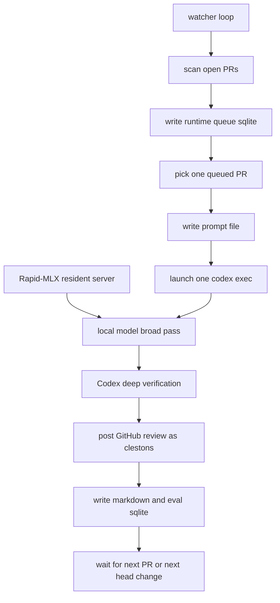

# PR-Daemon Product README

## 中文版

快速看 review 表现和 observability 命令，见：

- [REVIEW_OBSERVABILITY.md](./REVIEW_OBSERVABILITY.md)

### 产品定位

PR-Daemon 是一个以 **Claude Code（DeepSeek 后端）为主力 reviewer** 的 24/7 全自动 PK 式 PR review 系统，覆盖 aastar / auraai / mycelium 三个组织。

**三层架构（每次 review 必须全部走完）：**

| 层级 | 承担者 | 职责 |
|------|--------|------|
| Tier 1 主 reviewer | Claude Code（`run-dpsk-claude.sh` 路由到 DeepSeek API） | 深度阅读 diff 和上下文，独立形成 findings，主导最终裁决 |
| Tier 2 PK 挑战者（**必须**） | Codex（Claude Code 内部通过 `codex exec` 调用） | 以对抗方式挑战 Tier 1 的每一个 finding，禁止跳过 |
| Tier 3 可选广度扫描 | `skills/pk-review/scripts/local_review.py` via DeepSeek API | 先于 Tier 1 跑一遍宽广扫描，输出作为假设供 Tier 1 参考 |

**核心约束（不可妥协）：**

- **每次 review 必须经过 Codex PK 挑战环节（Tier 2）**，不可跳过，不可因"findings 已很明显"而省略。
- 只 review，不修改任何 PR 分支代码。
- 本地业务仓库 checkout 只用作 review 上下文，不改源码、配置、测试或锁文件。
- 只有用户明确批准后，才用 review 账号（`clestons`）发布 GitHub review。
- 禁止 merge PR，即使 review 结果是 APPROVE，最终 merge 由 PR 作者或 maintainer 决定。
- 发布任何 GitHub review 必须通过 `scripts/post_pr_review.sh`，不可直接调用 `gh pr review`。

**为什么用 DeepSeek 而不直接用 Claude API：**
DeepSeek 提供与 Anthropic API 完全兼容的端点（`https://api.deepseek.com/anthropic`），`run-dpsk-claude.sh` 通过 `ANTHROPIC_BASE_URL` 将 Claude Code CLI 的所有请求路由到 DeepSeek，以极低成本（约 1/10）获得与 Claude Code 相同的能力。Codex 作为独立进程单独调用，不参与路由。

### 账号分工

- 主账号：`jhfnetboy`
  - 用于发现 `jhfnetboy` 名下仍然 open 的 PR。
  - 用于维护主仓库、查看自己的 PR 队列。
  - 默认 active account 必须保持为这个账号。
- Review 账号：`clestons`
  - 邮箱：`clestons@gmail.com`。
  - 用于发布 PR review comment、approve 或 request changes。
  - 注意：`gh auth switch --user` 需要 GitHub login，不一定能直接使用邮箱。如果实际 login 不是 `clestons`，以 GitHub login 为准。

发布任何 GitHub review 前必须检查身份；发布完成后必须切回主账号：

```bash
gh auth status
gh api user -q .login
```

恢复默认主账号：

```bash
bash scripts/ensure_main_github_account.sh
```

切到 review 账号：

```bash
gh auth switch --hostname github.com --user clestons
gh api user -q .login
```

切回主账号：

```bash
gh auth switch --hostname github.com --user jhfnetboy
gh api user -q .login
```

GitHub CLI 可以保存同一 host 的多个账号，但同一时刻只有一个 active account。登录 review 账号后用 `gh auth switch` 切换。

推荐你在普通 Terminal 里登录 `clestons`：

```bash
gh auth login --hostname github.com --web --git-protocol https
gh auth switch --hostname github.com --user clestons
gh api user -q .login
```

如果用 token，建议不要发在聊天里；在本机 Terminal 用 stdin 写入：

```bash
pbpaste | gh auth login --hostname github.com --with-token
gh auth switch --hostname github.com --user clestons
```

classic token 最少需要 `repo`, `read:org`, `gist`。fine-grained token 至少需要目标 repo 的 metadata read、contents read、pull requests read/write；如果遇到行为奇怪，优先用 `GH_TOKEN=... gh ...` 做单次命令而不是写入全局 credential store。

也可以使用本项目的 `.env`，避免每次全局切换 `gh` credential store：

```bash
cp .env.example .env
```

然后在 `.env` 里填：

```bash
PR_DAEMON_REVIEW_USER=clestons
PR_DAEMON_REVIEW_TOKEN=github_pat_xxx
```

第一梯队 reviewer 也建议在 `.env` 里一起配好。默认策略是：

- 如果配置了 DeepSeek 这类 OpenAI-compatible API，就先用它做 broad first pass。
- 如果主 provider 失败、限流、余额用尽或不可达，就自动回退到本地 Rapid-MLX。
- Codex 的最终复核、GitHub review 发布、SQLite 记录逻辑不变。

示例：

```bash
PR_DAEMON_HTTPS_PROXY=
PR_DAEMON_HTTP_PROXY=
PR_DAEMON_ALL_PROXY=
PR_DAEMON_NO_PROXY=127.0.0.1,localhost

PR_DAEMON_FIRST_PASS_PROVIDER=deepseek
PR_DAEMON_FIRST_PASS_BASE_URL=https://api.deepseek.com/v1
PR_DAEMON_FIRST_PASS_MODEL=deepseek-v4-flash
PR_DAEMON_FIRST_PASS_API_KEY=sk-...
PR_DAEMON_FIRST_PASS_THINKING=disabled

PR_DAEMON_FALLBACK_PROVIDER=rapid-mlx
PR_DAEMON_FALLBACK_BASE_URL=http://127.0.0.1:8000/v1
PR_DAEMON_FALLBACK_MODEL=qwen3.6-a3b
```

对 PR-Daemon 的 first-pass，我这里默认建议 `deepseek-v4-flash` 加 `thinking=disabled`。原因很简单：它更快，也更不容易把输出 token 用在 `reasoning_content` 上，适合做第一层 broad pass；最终严肃判断仍然交给 Codex。

如果你的 `codex exec` 日志里出现这类错误：

```text
HTTP request failed: https://chatgpt.com/backend-api/wham/apps
```

这通常不是 DeepSeek 或 Rapid-MLX 的问题，而是 Codex CLI 自己连后端失败。PR-Daemon 不会自动读取 macOS 系统代理；要让 watcher 拉起的 `codex`、`gh`、`curl`、以及 first-pass HTTP 请求都走代理，请把代理写进 `.env`：

```bash
PR_DAEMON_HTTPS_PROXY=http://127.0.0.1:7890
PR_DAEMON_HTTP_PROXY=http://127.0.0.1:7890
PR_DAEMON_ALL_PROXY=socks5://127.0.0.1:7891
PR_DAEMON_NO_PROXY=127.0.0.1,localhost
```

改完后重启 watcher：

```bash
./watch.sh restart
```

`.env` 已被 `.gitignore` 忽略，不会提交。发布脚本会用 `GH_TOKEN=$PR_DAEMON_REVIEW_TOKEN` 单次调用 GitHub API，默认 active account 仍保持 `jhfnetboy`。

多组织 review token 规则：

- Fine-grained PAT 一次只能选择一个 resource owner，因此不适合一个 token 横跨 `AAStarCommunity`、`AuraAI`、`mycelium` 三个组织。
- 如果要一个 token 覆盖三个组织，短期可用 `clestons` 账号的 classic PAT，并确保三个组织都允许 classic PAT 访问。
- Classic PAT 权限建议：`repo`, `read:org`, `gist`。如果只做 PR review，不需要给 `admin:org`。
- 不建议为了 token 把 `clestons` 设成三个组织 admin。更合适的是把 `clestons` 加入三个组织，并给需要 review 的 repo 足够权限（通常 write/maintain 级别即可）。
- 长期更稳的是创建 GitHub App，安装到三个组织，授予 Pull requests write / Contents read / Metadata read；但这需要额外 App 私钥和 installation token 流程。

PR-Daemon 的发布脚本会自动临时切到 `clestons`，发布 review，然后切回 `jhfnetboy`：

```bash
bash scripts/post_pr_review.sh \
  --repo OWNER/REPO \
  --pr PR_NUMBER \
  --body-file /path/to/review.md \
  --request-changes
```

### 可选：本地模型（离线 fallback）

**本节为可选项**。主力架构已改为 Claude Code + DeepSeek API，不依赖本地 GPU。  
Rapid-MLX 本地模型仅在 DeepSeek API 不可用时用作 fallback first-pass，不影响主流程。

如需启用本地模型，目标 API model name 是：

```text
qwen3.6-a3b
```

Rapid-MLX 当前机器检查结果：

- `rapid-mlx` 已安装。
- 当前 `localhost:8000` 没有服务在监听，因此 `/docs` 和 `/v1/models` 现在不可访问。
- 当前 Rapid-MLX alias 列表里没有 `qwen3.6-a3b` 这个 loader alias。
- 当前可见的 qwen3.6 loader alias 包括 `qwen3.6-27b`、`qwen3.6-27b-8bit`、`qwen3.6-35b`、`qwen3.6-35b-6bit`、`qwen3.6-35b-8bit` 等。

因此本项目默认做法是：

- API 暴露名：`qwen3.6-a3b`
- Rapid-MLX 默认加载 alias：`qwen3.6-35b-6bit`
- 它对应的实际模型家族名就是 `Qwen3.6-35B-A3B-6bit`
- 这个 alias 走 Rapid-MLX/Hugging Face cache 的原生解析能力。
- 如果要从 `~/.omlx/models` 读模型，用 `RAPID_MLX_LOAD_MODEL` 显式指定本地路径。

注意这里是两层名字：

- `qwen3.6-a3b`：PR-Daemon 在 OpenAI-compatible API 里调用的 served model name
- `qwen3.6-35b-6bit` / `Qwen3.6-35B-A3B-6bit`：Rapid-MLX 实际加载的模型

如果你希望在 `~/.omlx/models` 里也能看到 6bit 模型，可以把 Hugging Face cache 里的 snapshot 暴露过去。推荐软链接模式，不重复占用 27GB：

```bash
scripts/materialize_omlx_model.sh
```

这个脚本会从：

```text
~/.cache/huggingface/hub/models--mlx-community--Qwen3.6-35B-A3B-6bit/snapshots/<hash>
```

软链接到：

```text
~/.omlx/models/Qwen3.6-35B-A3B-MLX-6bit
```

并用 `rapid-mlx info` 验证本地路径可加载。注意：软链接模式依赖 HF cache，不能删除原 cache。

使用 OMLX 路径启动：

```bash
export RAPID_MLX_LOAD_MODEL="$HOME/.omlx/models/Qwen3.6-35B-A3B-MLX-6bit"
scripts/rapid_mlx_daemon.sh ensure
```

如果你想真正复制到 `~/.omlx/models`，再删除 HF cache 副本：

```bash
scripts/materialize_omlx_model.sh --copy
```

复制模式验证成功后，可以手动删除 HF cache：

```bash
rapid-mlx rm mlx-community/Qwen3.6-35B-A3B-6bit
```

如果之后 Rapid-MLX 或本地 HF cache 里已有真正的 `qwen3.6-a3b`，设置：

```bash
export RAPID_MLX_LOAD_MODEL=qwen3.6-a3b
export RAPID_MLX_MODEL=qwen3.6-a3b
```

启动或确认常驻服务：

```bash
scripts/rapid_mlx_daemon.sh ensure
```

检查状态：

```bash
scripts/rapid_mlx_daemon.sh status
scripts/rapid_mlx_daemon.sh models
scripts/rapid_mlx_daemon.sh docs
scripts/rapid_mlx_daemon.sh smoke
```

如果 Codex/headless 无法访问 Metal，请在普通 Terminal 里启动常驻模型：

```bash
scripts/start_rapid_mlx_resident.sh
```

等价的手动启动命令：

```bash
rapid-mlx serve qwen3.6-35b-6bit \
  --host 127.0.0.1 \
  --port 8000 \
  --served-model-name qwen3.6-a3b \
  --prefill-step-size 4096 \
  --gpu-memory-utilization 0.85 \
  --enable-prefix-cache
```

API 地址：

```text
Docs: http://127.0.0.1:8000/docs
Models: http://127.0.0.1:8000/v1/models
Chat completions: http://127.0.0.1:8000/v1/chat/completions
```

### 快速启动：5 步上线 24 小时 PR Review

#### 第 0 步：Clone 仓库

```bash
git clone https://github.com/jhfnetboy/PR-Daemon.git
cd PR-Daemon
```

已有 clone 的跳到第 1 步。

#### 第 1 步：配置 .env

```bash
cp env.example .env
```

打开 `.env`，最少填以下三项即可运行：

```bash
DEEPSEEK_API_KEY=sk-...             # DeepSeek API Key，主 reviewer 后端
PR_DAEMON_REVIEW_TOKEN=ghp_...      # clestons 的 GitHub classic PAT（发布 review 用）
PR_DAEMON_REVIEW_USER=clestons      # 发布 review 的 GitHub 账号（默认 clestons）
```

代理（如果需要）：

```bash
PR_DAEMON_HTTPS_PROXY=http://127.0.0.1:7890
PR_DAEMON_HTTP_PROXY=http://127.0.0.1:7890
```

`.env` 已被 `.gitignore` 忽略，不会提交，可放心填真实密钥。

#### 第 2 步：初始化 SQLite 数据库

一次性初始化，创建所有运行时数据库和目录：

```bash
./scripts/bootstrap_pr_daemon.sh
```

它会创建：

| 路径 | 用途 |
|------|------|
| `.state/pr-daemon/pr-watch.sqlite` | 运行时 PR 队列（状态机） |
| `reviews/model-evals/model-evals.sqlite` | Review 评分历史（改进反馈循环） |
| `reviews/watch-prompts/` | dispatch prompt 目录 |

手动检查 SQLite 结构（可选）：

```bash
sqlite3 .state/pr-daemon/pr-watch.sqlite ".tables"
sqlite3 reviews/model-evals/model-evals.sqlite ".tables"
```

#### 第 3 步：安装 Claude Code Skills

**项目级**（当前仓库下的 Claude Code 会话自动可见，无需额外操作）：

```bash
./install-skills.sh            # 验证 .claude/skills/ 已就绪
```

**全局安装**（在任何目录下的 Claude Code 会话都可用）：

```bash
./install-skills.sh --global   # 复制到 ~/.claude/skills/ 并替换绝对路径
```

卸载全局安装：

```bash
./uninstall-skills.sh
```

Skill 功能说明：

| Skill | 调用方式 | 用途 |
|-------|----------|------|
| `pr-daemon-loop` | `$pr-daemon-loop` | 24/7 全自动 loop：发现 PR → 深度 review → Codex PK → 发布 |
| `pk-review` | `$pk-review` | 单个 PR 的完整 PK review |

#### 第 4 步：验证 GitHub 账号

```bash
gh api user -q .login    # 必须返回 jhfnetboy（主账号）
```

如果不是，切回主账号：

```bash
bash scripts/ensure_main_github_account.sh
```

#### 第 5 步：启动！

```bash
./run-dpsk-claude.sh
```

Claude Code 启动后，直接说（支持语音）：

```
Use $pr-daemon-loop to start the 24/7 review loop
```

或无人值守（headless）模式：

```bash
./run-dpsk-claude.sh -p "Use pr-daemon-loop. Start the continuous PR review daemon for jhfnetboy's open PRs across aastar, auraai, and mycelium. Post reviews as clestons. Run until stopped."
```

**到这里就跑起来了。** Claude Code 会持续发现 PR、深度 review、调 Codex PK 挑战、发布 review，直到你 Ctrl+C。

---

### 日常 Observability 命令

```bash
./watch.sh status        # watcher 状态
./watch.sh queue         # SQLite 队列（按状态分组）
./watch.sh current       # 当前正在 review 的 PR（JSON）
tail -f .state/pr-daemon/review-watch.log  # 实时日志

python3 scripts/model_eval_db.py provider-summary --limit 50   # 各 provider 评分汇总
python3 scripts/model_eval_db.py scorecard --owner OWNER --repo REPO --pr-number N  # 单 PR 评分
```

---

### 高级参考：Python Watcher 模式（可选）

以下内容为旧版 Python watcher 驱动的启动方式，供参考。  
**新架构下主流程是 `run-dpsk-claude.sh` + `$pr-daemon-loop`，不需要单独启动 watcher。**

#### 检查 GitHub 账号

默认账号应该是 `jhfnetboy`：

```bash
gh api user -q .login
```

如果不是，切回主账号：

```bash
bash scripts/ensure_main_github_account.sh
```

确认 `.env` 里有 review 账号 token，这样发布 review 时会临时用 `clestons`，不污染默认账号：

```bash
test -f .env && grep -E '^PR_DAEMON_REVIEW_USER=|^PR_DAEMON_REVIEW_TOKEN=' .env
```

#### 检查本地业务仓库

不要重复 clone。PR-Daemon 会优先使用这些本地路径：

```text
/Users/jason/Dev/aastar
/Users/jason/Dev/auraai
/Users/jason/Dev/mycelium
```

当前映射可用下面命令检查：

```bash
python3 scripts/resolve_repo.py AAStarCommunity/AirAccount
```

#### 4. 启动本地模型

如果是在普通 macOS Terminal 里，推荐常驻前台启动，日志会同时显示在屏幕并写入文件：

```bash
scripts/start_rapid_mlx_resident.sh
```

另开一个 Terminal 检查状态：

```bash
scripts/rapid_mlx_daemon.sh status
```

如果你就是想开一个带好目录权限的 Codex，会话入口也可以直接用：

```bash
./run.sh
```

日志默认写入：

```text
$HOME/.local/state/pr-daemon/rapid-mlx-8000.log
```

默认超过 50MB 自动轮转。可以调整：

```bash
PR_DAEMON_MAX_LOG_BYTES=$((100 * 1024 * 1024)) scripts/start_rapid_mlx_resident.sh
```

如果模型已经在跑，Codex/watcher 会把它当作 fallback reviewer 复用 `http://127.0.0.1:8000/v1`。

#### 5. 先跑一次安全扫描

这一步只扫描 open PR、写 SQLite、生成 Codex prompt，不会自动发 review：

```bash
python3 scripts/review_watch.py --max-reviews-per-cycle 3
```

查看扫描结果：

```bash
sqlite3 .state/pr-daemon/pr-watch.sqlite \
  'select repo, pr_number, status, review_decision, substr(head_oid,1,7), title from pr_watch_targets order by last_seen_at desc limit 20;'
```

查看生成的 prompt：

```bash
ls reviews/watch-prompts
```

#### 6. 启动后台 watcher

默认安全模式：只持续扫描和生成 prompt，不自动调用 Codex review：

```bash
scripts/start_review_watch.sh
```

查看 watcher 日志：

```bash
tail -f .state/pr-daemon/review-watch.log
```

停止 watcher：

```bash
scripts/start_review_watch.sh stop
```

查看当前 watcher 是不是 auto-review 模式：

```bash
scripts/start_review_watch.sh status
```

`status` 现在除了 pid/meta，还会附带当前 runtime 状态，例如：

- `active_review=owner/repo#pr`
- `loop_state=scan_start|refreshed|cycle_complete|idle|blocked_active_review`
- `processed_reviews=N`
- `updated_at=...`

查看当前队列状态：

```bash
./watch.sh queue
```

这里第一段会显示 `last_full_sync_epoch`，用来判断 watcher 最近一次全量远端刷新是什么时候。

查看当前正在审的 PR：

```bash
./watch.sh current
```

`watch.sh` 默认会把 watcher 的 pid、log、runtime SQLite 都放到仓库里的 `.state/pr-daemon/`，避免污染 Git 和避免 `$HOME/.local/state` 权限差异。

查看当前 PR 最近一次 first-pass 到底用了哪个 provider：

```bash
./watch.sh first-pass
./watch.sh first-pass MushroomDAO/Cos72 2
```

这会直接打印最近一份 `local-review` 产物里的 `Provider`、`Model`、`Fallback Switched` 等头信息。`Provider: deepseek` 且 `Fallback Switched: False` 表示这次 broad first pass 确实走了 DeepSeek，没有回退到本地 Rapid-MLX。

如果你改了下面这些文件，需要重启 watcher 才会生效：

- `scripts/review_watch.py`
- `scripts/start_review_watch.sh`
- `watch.sh`

命令：

```bash
./watch.sh restart
```

如果只是改了 `scripts/model_eval_db.py`，不需要专门重启 watcher；后续新的 review run 会自动用新逻辑写入评分记录。

如果 watcher 主进程不在了，但 `current-review.json` 还在，新的 watcher 会先进入 `blocked_active_review`，暂时不拿新的 PR，避免重复 review 同一条。默认超过 `PR_DAEMON_ACTIVE_REVIEW_STALE_SECONDS=14400`（4 小时）的 `current-review.json` 会被当作 stale 自动清掉。

#### 7. 启动 canary 自动 review

确认安全扫描正常后，再启用自动 review。`./watch.sh` 现在默认是更实用的节流：

- `PR_DAEMON_MAX_REVIEWS_PER_CYCLE=3`
- `PR_DAEMON_WATCH_INTERVAL=30`

也就是每轮最多连续处理 3 个 PR，处理完后只等 30 秒再继续下一轮。

如果你想显式指定，命令是：

```bash
PR_DAEMON_AUTO_REVIEW=1 \
PR_DAEMON_MAX_REVIEWS_PER_CYCLE=3 \
PR_DAEMON_WATCH_INTERVAL=30 \
./watch.sh restart
```

想先看它会启动什么命令，不真正调用 Codex：

```bash
PR_DAEMON_AUTO_REVIEW=1 \
PR_DAEMON_DRY_RUN=1 \
PR_DAEMON_MAX_REVIEWS_PER_CYCLE=3 \
PR_DAEMON_WATCH_INTERVAL=30 \
./watch.sh restart
```

注意：这里必须写成一条命令前缀，不要写成下面这种形式：

```bash
PR_DAEMON_AUTO_REVIEW=1 && PR_DAEMON_DRY_RUN=0 && ./scripts/start_review_watch.sh
```

那样只是在当前 shell 里设置了变量，不保证传给已经存在的 watcher 进程。正确写法是：

```bash
PR_DAEMON_AUTO_REVIEW=1 PR_DAEMON_DRY_RUN=0 PR_DAEMON_MAX_REVIEWS_PER_CYCLE=3 PR_DAEMON_WATCH_INTERVAL=30 ./watch.sh restart
```

#### 8. 循环如何工作

这套系统不是“本地模型先把所有 PR 批量 review 一遍，再统一叫一次 Codex”。当前实现是“扫描是批量的，真正 review 是逐个 PR 调一次 Codex”。

- DeepSeek 之类主 provider 只负责 first-pass API 调用，本身不扫描 PR，也不发 GitHub review。
- Rapid-MLX 只负责本地 fallback first-pass API，本身不扫描 PR，也不发 GitHub review。
- watcher 先把远端 open PR 扫描入库，写入运行时队列库 `.state/pr-daemon/pr-watch.sqlite`。
- 之后优先按 SQLite 里的状态队列逐个处理，不会每一轮都重新全量扫描远端。
- 只有当队列空了，或者到了 `refresh_interval`，watcher 才会再做一次全量远端刷新。
- 新 PR、没有 review 的 PR、head commit 变化的 PR 会进入队列。
- watcher 对每个排队 PR 先生成一个 prompt 文件，再单独启动一次 `codex exec`。
- 这个 Codex review 进程内部会先调用配置好的 first-pass reviewer；默认优先走 DeepSeek，失败后回退到本地 Rapid-MLX；然后再由 Codex 自己复核源码、diff、测试和历史 SQL 改进项。
- Codex 必须发布 GitHub review/comment，并把本地模型评分和复盘写回 Markdown/SQLite。
- 如果是 `REQUEST_CHANGES`，watcher 等 PR 作者 push 新 commit 后再复审。
- 如果最终 `APPROVE`，Codex 仍然禁止 merge；PR 作者或 maintainer 看完 comment 后自己 merge。
- PR merge 后，GitHub 内置 `delete_branch_on_merge=true` 会删除远端分支。

流程图：



什么时候会调用本地模型：

- 只有当 watcher 已经挑中某一个 PR，并且成功启动了对应的 `codex exec`，first-pass reviewer 才会被调用。
- 单纯“watcher 在扫描”不会调用本地模型。
- 单纯“prompt 已生成”也不会调用 first-pass reviewer，只有真正进入那个 PR 的 Codex review 进程才会调用。
- 如果主 provider 正常，这一轮可能完全不会打到本地 Rapid-MLX；只有主 provider 失败时才会回退到本地模型。

怎么看本地模型有没有被调用：

```bash
tail -f .state/pr-daemon/review-watch.log
```

看到 `LAUNCH owner/repo #123 ...`，表示 watcher 已经开始拉起该 PR 的 Codex review。

如果 `LAUNCH` 后面紧接着是 Codex CLI 自身错误，说明问题发生在“启动 Codex review”这一步，还没真正进入本地模型调用。

```bash
./watch.sh current
```

如果有输出 JSON，表示当前有一个 PR 正在被 Codex 处理。

```bash
scripts/rapid_mlx_daemon.sh status
tail -f "$HOME/.local/state/pr-daemon/rapid-mlx-8000.log"
```

前者确认模型服务活着；后者用来观察 Rapid-MLX 服务日志是否持续有请求。

#### 9. 查看本地模型是否变好

```bash
python3 scripts/model_eval_db.py scorecard --owner AAStarCommunity --repo AirAccount --pr-number 34 --limit 5
python3 scripts/model_eval_db.py provider-summary --limit 50
python3 scripts/model_eval_db.py provider-summary --owner MushroomDAO --limit 20
```

每次 review 都会记录：

- 本地模型评分。
- 它找到的有效问题。
- 它的误报。
- 它漏掉的问题。
- 上一次改进项这次是否真的改善。
- 下一次 prompt 应强化什么。

`provider-summary` 用来跨 PR 看 first-pass provider 的整体表现，例如 `deepseek` 和 `rapid-mlx` 的平均分、fallback 次数和 verdict 分布。

#### 9.1 数据库初始化和重建

从零初始化：

```bash
./scripts/bootstrap_pr_daemon.sh
```

只重建 runtime watch DB，不动历史评分库：

```bash
./scripts/reset_pr_daemon_state.sh
```

连 `reviews/model-evals/model-evals.sqlite` 也一起重建：

```bash
./scripts/reset_pr_daemon_state.sh --wipe-model-eval-db
```

如果你只想手动初始化某个库，也可以直接跑：

```bash
python3 scripts/review_watch.py --db .state/pr-daemon/pr-watch.sqlite --init-db
python3 scripts/model_eval_db.py init --db reviews/model-evals/model-evals.sqlite
```

注意这里 `model_eval_db.py` 的 `--db` 写在子命令后面：

```bash
python3 scripts/model_eval_db.py scorecard --db reviews/model-evals/model-evals.sqlite --owner MushroomDAO --repo Cos72 --pr-number 2
```

#### 10. 本地 `origin/main.lock` 权限问题

如果 push 成功但出现：

```text
cannot lock ref 'refs/remotes/origin/main'
```

这通常不是远端 push 失败，而是当前 Codex 沙箱不能写本地 `.git/refs/remotes/origin`。先用远端确认：

```bash
git ls-remote origin refs/heads/main
```

如果远端 hash 是新 commit，说明 push 已成功。

在普通 Terminal 里可以检查本地是否能写：

```bash
cd /Users/jason/Dev/tools/PR-Daemon
touch .git/refs/remotes/origin/.write-test && rm .git/refs/remotes/origin/.write-test
```

如果普通 Terminal 也失败，修本地权限：

```bash
sudo chown -R "$USER":staff .git/refs/remotes .git/logs/refs/remotes
chmod -R u+rwX .git/refs/remotes .git/logs/refs/remotes
```

如果普通 Terminal 能写、但 Codex 不能写，这是本次 Codex 沙箱限制。下次启动 Codex 时继续把仓库作为 writable workspace 加入即可；push 仍然可以成功，验证远端用 `git ls-remote`。

同类问题也会出现在：

```text
.git/refs/tags/v0.3.0.lock: Operation not permitted
```

根因通常不是 git 配置错，而是当前 Codex 运行环境对 `.git` 只有读权限，不能创建新的 ref lock 文件。也就是说：

- 改工作区文件可以
- push 远端大多可以
- 但本地更新 `refs/remotes/*`、`refs/tags/*`、某些本地 git 元数据时会失败

这在当前受管沙盒里是权限边界，不是 PR-Daemon 代码逻辑问题。

解决方法有两个：

1. 在你自己的普通 Terminal 里执行本地 tag/ref 操作：

```bash
git tag -a v0.3.0 -m "PR-Daemon v0.3.0"
git push origin v0.3.0
```

2. 如果只是想在远端创建 tag，不依赖本地 tag 对象，也可以直接推远端 ref：

```bash
git push origin COMMIT_SHA:refs/tags/v0.3.0
```

如果你希望 Codex 以后也能直接本地打 tag，根本办法不是改 PR-Daemon，而是让启动 Codex 的宿主环境允许写 `.git/refs`。在当前这个 managed sandbox 里，这个权限默认没有。

#### 11. 普通人每天要做什么

正常情况下只要做三件事：

1. 开一个 Terminal 跑 `scripts/start_rapid_mlx_resident.sh`。
2. 开另一个 Terminal 跑 `./watch.sh restart`。
3. 定期看 `./watch.sh queue`、`./watch.sh current`、`tail -f .state/pr-daemon/review-watch.log`、GitHub PR comments、以及 `model_eval_db.py scorecard`。

### 每次怎么用

进入本目录后，对 Codex 说：

```text
Use $rapid-mlx-review. Ensure the local Rapid-MLX model is available, find open PRs authored by jhfnetboy, pick the next review target, make qwen3.6-a3b do the broad first pass and challenge rounds, then Codex performs final adjudication and owns the result. Do not edit the PR branch. Generate review comments locally first; do not post unless I explicitly approve posting with clestons.
```

指定某个 PR：

```text
Use $rapid-mlx-review to review OWNER/REPO#123 in PK mode. Use qwen3.6-a3b heavily through Rapid-MLX for triage, initial findings, challenge, and comment drafting. Codex makes the final call. Do not modify code.
```

只 review 当前仓库 diff：

```text
Use $rapid-mlx-review to review this repository. Compare against origin/main, include worktree changes if relevant, run local qwen3.6-a3b first, then Codex adjudicates.
```

### Open PR 获取

不要依赖 `@me` 查队列，因为 active GitHub account 可能是 `clestons`。发现队列时显式查询 `jhfnetboy`：

```bash
python3 scripts/list_open_prs.py
python3 scripts/list_open_prs.py --repo OWNER/REPO
python3 scripts/list_open_prs.py --json
```

底层等价命令：

```bash
gh search prs \
  --author jhfnetboy \
  --state open \
  --json number,title,repository,url,updatedAt,isDraft,author \
  --limit 50
```

`prbot` 可作为人工队列面板：

```bash
prbot all
prbot OWNER/REPO
```

但自动 review 队列以 `scripts/list_open_prs.py` 或显式 `gh search prs --author jhfnetboy` 为准。

### 本地 Repo 映射

PR review 不默认 clone 到 `/tmp`。先按组织映射解析本地 checkout：

| GitHub owner / org | Local root |
|--------------------|------------|
| `AAStarCommunity` / `aastar` | `~/Dev/aastar` |
| `AuraAI` / `auraai` | `~/Dev/auraai` |
| `mycelium` | `~/Dev/mycelium` |

配置文件：

```bash
config/repo-roots.json
```

新增或更新映射：

```bash
python3 scripts/add_repo_root.py OWNER ~/Dev/path --alias short-name
```

解析 repo：

```bash
python3 scripts/resolve_repo.py AAStarCommunity/AirAccount
```

规则：

- 如果 repo 已在对应 root 下，直接使用该本地 checkout。
- 如果没有，clone 到对应 root，例如 `~/Dev/aastar/AirAccount`。
- `/tmp` 只用于短生命周期 diff 文件，不用于常规 PR checkout。
- 注意：Codex 是否能在这些目录里 `git fetch`/checkout，取决于本次会话的 writable roots。当前会话只允许写 PR-Daemon 和 `/tmp`，所以外部 repo 只能读；要让 Codex 直接更新这些 repo，需要下次启动时把对应目录加入 workspace/writable roots。
- 即使这些目录是 writable roots，也仍然禁止修改业务代码。可写权限只用于 `git fetch`、checkout review ref、读取索引和生成临时 review 工件。

启动 Codex 时建议加入这些 workspace/writable roots：

```text
/Users/jason/Dev/tools/PR-Daemon
/Users/jason/Dev/aastar
/Users/jason/Dev/auraai
/Users/jason/Dev/mycelium
```

同样内容记录在：

```bash
config/workspace-roots.txt
```

这些 roots 需要在新会话启动时由 Codex/客户端加载；当前会话中不能动态扩展 sandbox writable roots。

如果用 Codex CLI，直接从普通 Terminal 执行：

```bash
cd /Users/jason/Dev/tools/PR-Daemon
bash scripts/start_codex_pr_daemon.sh
```

等价手动命令：

```bash
codex \
  --cd /Users/jason/Dev/tools/PR-Daemon \
  --sandbox workspace-write \
  --add-dir /Users/jason/Dev/aastar \
  --add-dir /Users/jason/Dev/auraai \
  --add-dir /Users/jason/Dev/mycelium
```

`~/.codex/config.toml` 里的 `[projects] trust_level` 只表示信任项目，不等于本次会话可写目录；真正的额外可写目录要用 `--add-dir` 或客户端启动参数传入。

### PK Review 分工

本地 `qwen3.6-a3b` 应尽量多干活：

- PR 队列摘要和优先级建议。
- diff 初审和风险点枚举。
- 按文件生成上下文摘要。
- 对可疑代码路径提出问题。
- 对 Codex finding 做反向 challenge。
- 草拟最终 review comment。
- 草拟修复建议和测试建议。

Codex 负责更难且必须兜底的工作：

- 独立阅读 diff 和关键上下文。
- 判断 local finding 是否成立。
- 找安全、并发、数据丢失、权限、供应链、API contract、CI 误配置等高风险问题。
- 判断问题严重程度、业务影响和可能损失。
- 决定最终是否 request changes。
- 对最终输出负责。

### 标准流程

1. 选 PR
   - 拉取 `jhfnetboy` authored open PR。
   - 默认跳过 draft。
   - 优先处理最近更新、风险高、影响范围大、已有 review request 的 PR。

2. 准备 diff
   - checkout 或 fetch PR。
   - 使用 PR base branch；无法确认时默认 `origin/main`。
   - 生成 merge-base diff。

3. Local Round
   - 确认 Rapid-MLX 常驻服务。
   - 用 `qwen3.6-a3b` 做初审：

```bash
python3 skills/rapid-mlx-review/scripts/local_review.py \
  --repo TARGET_REPO \
  --base origin/main \
  --target HEAD \
  --model qwen3.6-a3b \
  --output /tmp/rapid-mlx-local-review.md
```

4. Codex Deep Round
   - Codex 不先相信 local 输出。
   - 独立读 diff、相关文件、调用链和配置。
   - 运行可行的测试或静态检查。

5. Challenge Round
   - Codex 裁决 local findings。
   - 对复杂 finding，让 local 模型再 challenge 一轮。
   - 最多两轮 challenge，除非用户要求继续。

6. Final Review
   - 输出 confirmed/codex-only/rejected。
   - 给出影响、可能损失、修复建议和 PR comment 文案。
   - 默认不发布。

### 输出格式

```text
Findings

[Confirmed] High - path/to/file.py:123 - title
Evidence:
Impact:
Potential loss:
Fix:
Suggested PR comment:

[Codex-only] Medium - path/to/file.ts:45 - title
Evidence:
Impact:
Potential loss:
Fix:
Suggested PR comment:

Rejected Local Findings
- Finding title: rejected reason.

Local Model Work
- Triage:
- Useful findings:
- Missed:
- Overreached:
- Challenge result:

Verification
- Commands run:
- Tests not run:

Posting
- Current GitHub account:
- Posting status: not posted / posted by clestons
```

### 发布 Comment

默认不发布。用户明确批准后才执行：

```bash
bash scripts/post_pr_review.sh \
  --repo OWNER/REPO \
  --pr PR_NUMBER \
  --body-file /tmp/pr-review-final.md \
  --comment
```

需要阻塞 PR 时：

```bash
bash scripts/post_pr_review.sh \
  --repo OWNER/REPO \
  --pr PR_NUMBER \
  --body-file /tmp/pr-review-final.md \
  --request-changes
```

发布前必须确认：

- 当前账号是 review 账号。
- repo 和 PR number 正确。
- 用户明确允许发布。
- 最终 finding 已由 Codex 负责确认。

### 当前文件

- Skill：`skills/rapid-mlx-review/SKILL.md`
- 本地初审脚本：`skills/rapid-mlx-review/scripts/local_review.py`
- Rapid-MLX 常驻服务脚本：`scripts/rapid_mlx_daemon.sh`
- 普通 Terminal 常驻启动脚本：`scripts/start_rapid_mlx_resident.sh`
- Open PR 队列脚本：`scripts/list_open_prs.py`
- 安全发布 review 脚本：`scripts/post_pr_review.sh`
- 本地 repo 解析脚本：`scripts/resolve_repo.py`
- 本地 repo 映射新增脚本：`scripts/add_repo_root.py`
- 本地 repo 映射：`config/repo-roots.json`
- GitHub 账号配置：`config/accounts.json`
- 恢复主账号脚本：`scripts/ensure_main_github_account.sh`
- 本地模型评估 SQLite 记录脚本：`scripts/model_eval_db.py`
- 本地模型评估数据库：`reviews/model-evals/model-evals.sqlite`
- 参考工具：`prbot`

### 本地模型评估记录

每次使用 `qwen3.6-a3b` 做 PR review 后，必须同时记录两类结果：

- Markdown 记录：写入 `reviews/model-evals/`，保留人工可读的评分、贡献、误报、漏报、prompt gap、Codex adjudication。
- SQLite 记录：用 `scripts/model_eval_db.py record-run` 写入 `reviews/model-evals/model-evals.sqlite`，记录本轮 score、模型表现、上轮改进项是否真的改善、以及下一轮 prompt 改进项。

复查同一个 PR 时，`skills/rapid-mlx-review/scripts/local_review.py` 可以通过 `--eval-db reviews/model-evals/model-evals.sqlite --owner OWNER --repo-name REPO --pr-number N` 自动读取历史改进项，并把它们注入本地模型 prompt。Codex 仍然必须独立验证本地模型输出；SQL 只用于让本地模型持续改进，不替代最终 review 判断。

本地模型更适合承担这些工作：

- 批量 review 的第一轮 triage：摘要改动范围、列出风险区域、挑出值得 Codex 深挖的文件。
- 重复性检查：把上一轮 review finding、adversarial case、测试清单逐项复核。
- 安全 gate / grep / 配置类检查的候选反例生成，例如列出所有合法参数形式再做 truth table。
- Review 记录整理：把 local findings、Codex adjudication、误报、漏报、评分和下轮改进项结构化写入 SQL/Markdown。
- 非最终 comment 草稿：提供初稿，但最终结论必须由 Codex 复核后发布。

本地模型不适合单独承担最终判断，尤其是安全边界、并发/状态机、跨模块协议、链上/TEE/CI gate 这类高风险问题。Codex 必须独立看 diff、跑验证命令，并把本地模型输出标记为 confirmed、rejected、missed 或 Codex-only。

### 本地模型正循环

每次 review 后按同一套闭环推进：

1. 本地模型先做 broad pass，并自动读取 SQL 中仍需携带的改进项。
2. Codex 独立复查，验证每个 finding 和 carried-forward improvement。
3. Codex 给本地模型打 0-10 分，记录 useful findings、false positives、misses、prompt gaps。
4. 用 `scripts/model_eval_db.py record-run` 写入本次评分和下一轮改进项。
5. 用 `scripts/model_eval_db.py assess-item` 标记上一轮改进是否真的生效：
   - `effective`：本轮确实改善，停止继续携带。
   - `ineffective`：本轮没有改善，继续携带并需要更强约束。
   - `needs_followup`：部分改善，但仍需下轮验证。
   - `retired`：不再适用。
6. 下次 review 只把 `carried_to_next=1` 的改进项注入 prompt，避免越积越乱。
7. 用 `scripts/model_eval_db.py scorecard` 查看最近评分、改进项状态和未解决问题，判断模型能力是否真的提升。

有效提升的判定不是“模型说得更像”，而是可量化结果：

- 同类 miss 是否减少。
- false positive 是否减少。
- 是否遵守输出格式和 truth table 要求。
- carried-forward improvement 是否被正确执行。
- Codex-only blocker 数量是否下降。
- GitHub review 结论是否更快、更少返工。

常用命令：

```bash
python3 scripts/model_eval_db.py prior-context \
  --owner AAStarCommunity --repo AirAccount --pr-number 30

python3 scripts/model_eval_db.py scorecard \
  --owner AAStarCommunity --repo AirAccount --pr-number 30

python3 scripts/model_eval_db.py assess-item \
  --item-id 3 \
  --status ineffective \
  --evaluation "SQL context included -F examples, but the model still missed the alias."
```

### 自动 Review Watcher

PR-Daemon 的 24 小时循环由独立 watcher 脚本负责，Codex 负责被 watcher 启动后执行一次具体 review。推荐结构：

- `scripts/review_watch.py`：独立 daemon，读取 `~/.config/prbot/repos.conf`，扫描所有 open PR，写入 `reviews/pr-watch.sqlite`，检测新 PR、head 变化、review 状态变化，并生成 Codex prompt。
- `codex exec`：每次只处理一个 PR，使用 `$rapid-mlx-review`、本地模型、Codex 复核、GitHub review posting、SQLite/Markdown 记录。
- `scripts/start_review_watch.sh`：后台启动 watcher，默认只生成 prompt，不自动发 review。

默认安全模式：

```bash
scripts/start_review_watch.sh
```

Canary 自动 review 模式，一次循环最多处理 1 个 PR：

```bash
PR_DAEMON_AUTO_REVIEW=1 \
PR_DAEMON_MAX_REVIEWS_PER_CYCLE=1 \
scripts/start_review_watch.sh
```

dry-run 自动 review，只打印将启动的 Codex 命令：

```bash
PR_DAEMON_AUTO_REVIEW=1 \
PR_DAEMON_DRY_RUN=1 \
scripts/start_review_watch.sh
```

一次性扫描并生成 prompt：

```bash
python3 scripts/review_watch.py --max-reviews-per-cycle 3
```

loop 的职责边界：

- watcher 不直接决定 approve/request changes，只负责发现 PR 和启动 Codex。
- Codex 每次 review 必须发 GitHub review/comment，并更新本地 SQL/Markdown。
- watcher 看到同一个 PR head 变化后会再次入队，适合“被修复后自动复审”。
- PR merged/closed 后，GitHub 仓库设置 `delete_branch_on_merge=true` 会自动删远端 head branch；PR-Daemon 后续只做本地 stale branch cleanup/fallback。

GitHub merged branch 自动删除：

- prbot 配置范围内 71 个 repo 已检查。
- 69 个 active repo 已开启或原本已开启 `delete_branch_on_merge`。
- 2 个 archived repo 无法修改：`AAStarCommunity/Adapters`、`AAStarCommunity/Gateway`。

### Review 完成契约

每次 PR review 必须满足三个条件才算完成：

- 有明确结论：`APPROVE`、`REQUEST_CHANGES`、或只留 `COMMENT` 的非阻塞结论。
- 必须在 GitHub PR 上留下对应 review/comment；如果发布失败，必须记录失败原因并继续修复发布流程。
- 必须更新本地记录：review 文案、local model markdown 评估、SQLite 评分与改进项都要同步更新。
- 禁止 merge PR，即使已经 approve。发起方/maintainer 必须自己读完 comment 后决定是否 merge。

### 已知问题记录

2026-06-05：在 Codex/headless 沙箱中直接启动 Rapid-MLX 失败，日志为 `No Metal device available`。这是当前进程无法访问 macOS Metal GPU，不是模型文件路径错误。

正确处理：

- 首先复用已常驻的 `http://127.0.0.1:8000/v1`。
- 如果服务未启动，从普通 macOS Terminal/user session 启动 Rapid-MLX。
- Codex 只检查 `/v1/models`、`/docs`、`/chat/completions`，不要假设自己一定能在沙箱里加载 MLX。

### 下一步产品能力

- `scripts/review_pr.py`：自动 checkout PR、跑 local review、保存 Codex 输入材料。
- `scripts/post_review.py`：只负责用 `clestons` 发布已确认文案。
- Review history：继续扩展到记录每个 PR 的最终 comment、发布时间和 GitHub review 状态；本地模型评分与改进项已先落到 SQLite。
- Local challenge API：把 Codex finding 列表交给 `qwen3.6-a3b` 做结构化反驳。

---

## English Version

### Product Positioning

PR-Daemon is a Codex skill project for PK-style pull request review. It is designed to fully use the free local Apple Silicon compute and a resident local model named `qwen3.6-a3b`. Rapid-MLX loads the model and exposes an OpenAI-compatible API. The local model handles broad, cheap, high-volume work such as first-pass review, summarization, challenge rounds, and review comment drafting. Codex handles the hard senior-review work and is accountable for the final verdict.

Default rules:

- Review only; do not modify the PR branch.
- Never directly modify local business repository code. Local checkouts are review context only.
- Temporary diff/report files are allowed outside business repos. If temporary files must be created inside a business repo, they must live under explicit temporary/ignored paths and must not modify source, config, tests, or lock files.
- Generate local review text first; do not post to GitHub by default.
- Post comments, approve, or request changes only after explicit user approval.
- Treat local model output as useful hypotheses, not final truth. Codex must verify final findings with code, diffs, tests, or reproducible reasoning.

### Account Roles

- Primary account: `jhfnetboy`
  - Discovers open PRs authored by `jhfnetboy`.
  - Maintains repositories and the main PR queue.
  - This should remain the default active account.
- Review account: `clestons`
  - Email: `clestons@gmail.com`.
  - Posts PR review comments, approvals, or request-changes reviews.
  - `gh auth switch --user` expects a GitHub login, not necessarily an email address.

Always verify identity before posting. After posting, switch back to the primary account:

```bash
gh auth status
gh api user -q .login
```

Restore the default primary account:

```bash
bash scripts/ensure_main_github_account.sh
```

Switch to the review account:

```bash
gh auth switch --hostname github.com --user clestons
gh api user -q .login
```

Switch back to the primary account:

```bash
gh auth switch --hostname github.com --user jhfnetboy
gh api user -q .login
```

GitHub CLI can store multiple accounts for the same host, but only one account is active at a time. After logging in the review account, use `gh auth switch`.

Recommended login flow in a normal Terminal:

```bash
gh auth login --hostname github.com --web --git-protocol https
gh auth switch --hostname github.com --user clestons
gh api user -q .login
```

For token login, avoid sending the token in chat. Use stdin locally:

```bash
pbpaste | gh auth login --hostname github.com --with-token
gh auth switch --hostname github.com --user clestons
```

A classic token needs at least `repo`, `read:org`, and `gist`. A fine-grained token needs metadata read, contents read, and pull requests read/write for the target repo; for automation, prefer `GH_TOKEN=... gh ...` for one command if needed.

You can also use a local `.env` file so the global `gh` credential store does not need to switch accounts every time:

```bash
cp .env.example .env
```

Then set:

```bash
PR_DAEMON_REVIEW_USER=clestons
PR_DAEMON_REVIEW_TOKEN=github_pat_xxx
```

`.env` is ignored by Git. The posting script uses `GH_TOKEN=$PR_DAEMON_REVIEW_TOKEN` for a single GitHub API command, while the default active account remains `jhfnetboy`.

Multi-organization review token rules:

- A fine-grained PAT can target only one resource owner, so it is not suitable for one token spanning `AAStarCommunity`, `AuraAI`, and `mycelium`.
- For one token across all three organizations, the short-term option is a classic PAT from `clestons`, assuming all three organizations allow classic PAT access.
- Recommended classic PAT scopes: `repo`, `read:org`, `gist`. PR review does not require `admin:org`.
- Do not make `clestons` an org admin only for token convenience. Add `clestons` to the organizations and grant sufficient repository permissions for review, usually write/maintain.
- Long-term, a GitHub App installed in all three organizations is cleaner and more auditable, with Pull requests write / Contents read / Metadata read permissions.

The PR-Daemon posting script temporarily switches to `clestons`, posts the review, and switches back to `jhfnetboy`:

```bash
bash scripts/post_pr_review.sh \
  --repo OWNER/REPO \
  --pr PR_NUMBER \
  --body-file /path/to/review.md \
  --request-changes
```

### Resident Local Model

Target API model name:

```text
qwen3.6-a3b
```

Current Rapid-MLX check on this machine:

- `rapid-mlx` is installed.
- Nothing is currently listening on `localhost:8000`, so `/docs` and `/v1/models` are not available until the server starts.
- The current Rapid-MLX alias list does not include `qwen3.6-a3b` as a loader alias.
- Available qwen3.6 loader aliases include `qwen3.6-27b`, `qwen3.6-27b-8bit`, `qwen3.6-35b`, `qwen3.6-35b-6bit`, and `qwen3.6-35b-8bit`.

Default project behavior:

- API served model name: `qwen3.6-a3b`
- Rapid-MLX default loader alias: `qwen3.6-35b-6bit`
- This alias uses Rapid-MLX/Hugging Face cache resolution.
- To load from `~/.omlx/models`, explicitly set `RAPID_MLX_LOAD_MODEL` to the local path.

If you want the 6bit model visible under `~/.omlx/models`, expose the Hugging Face cache snapshot there. Symlink mode is recommended because it does not duplicate 27GB of weights:

```bash
scripts/materialize_omlx_model.sh
```

The script copies from:

```text
~/.cache/huggingface/hub/models--mlx-community--Qwen3.6-35B-A3B-6bit/snapshots/<hash>
```

to:

```text
~/.omlx/models/Qwen3.6-35B-A3B-MLX-6bit
```

Then it validates the local path with `rapid-mlx info`. Symlink mode depends on the HF cache, so do not remove the original cache.

Start with the OMLX path:

```bash
export RAPID_MLX_LOAD_MODEL="$HOME/.omlx/models/Qwen3.6-35B-A3B-MLX-6bit"
scripts/rapid_mlx_daemon.sh ensure
```

If you want a real copy under `~/.omlx/models` and then remove the HF cache copy:

```bash
scripts/materialize_omlx_model.sh --copy
```

After copy-mode validation:

```bash
rapid-mlx rm mlx-community/Qwen3.6-35B-A3B-6bit
```

If a real `qwen3.6-a3b` alias or HF path becomes available locally:

```bash
export RAPID_MLX_LOAD_MODEL=qwen3.6-a3b
export RAPID_MLX_MODEL=qwen3.6-a3b
```

Start or ensure the resident server:

```bash
scripts/rapid_mlx_daemon.sh ensure
```

Check it:

```bash
scripts/rapid_mlx_daemon.sh status
scripts/rapid_mlx_daemon.sh models
scripts/rapid_mlx_daemon.sh docs
scripts/rapid_mlx_daemon.sh smoke
```

If Codex/headless cannot access Metal, start the resident model from a normal Terminal:

```bash
scripts/start_rapid_mlx_resident.sh
```

Equivalent manual command:

```bash
rapid-mlx serve qwen3.6-35b-6bit \
  --host 127.0.0.1 \
  --port 8000 \
  --served-model-name qwen3.6-a3b \
  --prefill-step-size 4096 \
  --gpu-memory-utilization 0.85 \
  --enable-prefix-cache
```

API endpoints:

```text
Docs: http://127.0.0.1:8000/docs
Models: http://127.0.0.1:8000/v1/models
Chat completions: http://127.0.0.1:8000/v1/chat/completions
```

### Normal Usage

Ask Codex from this directory:

```text
Use $rapid-mlx-review. Ensure the local Rapid-MLX model is available, find open PRs authored by jhfnetboy, pick the next review target, make qwen3.6-a3b do the broad first pass and challenge rounds, then Codex performs final adjudication and owns the result. Do not edit the PR branch. Generate review comments locally first; do not post unless I explicitly approve posting with clestons.
```

Review a specific PR:

```text
Use $rapid-mlx-review to review OWNER/REPO#123 in PK mode. Use qwen3.6-a3b heavily through Rapid-MLX for triage, initial findings, challenge, and comment drafting. Codex makes the final call. Do not modify code.
```

Review the current repo diff:

```text
Use $rapid-mlx-review to review this repository. Compare against origin/main, include worktree changes if relevant, run local qwen3.6-a3b first, then Codex adjudicates.
```

### Open PR Discovery

Do not rely on `@me`, because the active GitHub account may be `clestons`. Discover the queue with explicit author filtering:

```bash
python3 scripts/list_open_prs.py
python3 scripts/list_open_prs.py --repo OWNER/REPO
python3 scripts/list_open_prs.py --json
```

Underlying command:

```bash
gh search prs \
  --author jhfnetboy \
  --state open \
  --json number,title,repository,url,updatedAt,isDraft,author \
  --limit 50
```

`prbot` can be used as a human dashboard:

```bash
prbot all
prbot OWNER/REPO
```

The automated review queue should use `scripts/list_open_prs.py` or explicit `gh search prs --author jhfnetboy`.

### Local Repo Mapping

PR review should not clone to `/tmp` by default. Resolve local checkouts by organization first:

| GitHub owner / org | Local root |
|--------------------|------------|
| `AAStarCommunity` / `aastar` | `~/Dev/aastar` |
| `AuraAI` / `auraai` | `~/Dev/auraai` |
| `mycelium` | `~/Dev/mycelium` |

Config file:

```bash
config/repo-roots.json
```

Add or update a mapping:

```bash
python3 scripts/add_repo_root.py OWNER ~/Dev/path --alias short-name
```

Resolve a repo:

```bash
python3 scripts/resolve_repo.py AAStarCommunity/AirAccount
```

Rules:

- If the repo exists under the mapped root, use that checkout.
- If it is missing, clone into the mapped root, for example `~/Dev/aastar/AirAccount`.
- `/tmp` is only for short-lived diff files, not normal PR checkouts.
- Whether Codex can `git fetch`/checkout inside these roots depends on this session's writable roots. In the current session, only PR-Daemon and `/tmp` are writable, so external repos are read-only. Add those directories as workspace/writable roots in the next session if Codex should update them directly.
- Even if these directories are writable roots, modifying business code is still forbidden. Write access is only for `git fetch`, checking out review refs, reading indexes, and producing temporary review artifacts.

Recommended workspace/writable roots when starting Codex:

```text
/Users/jason/Dev/tools/PR-Daemon
/Users/jason/Dev/aastar
/Users/jason/Dev/auraai
/Users/jason/Dev/mycelium
```

The same list is recorded in:

```bash
config/workspace-roots.txt
```

These roots must be loaded by Codex/the client when starting a new session. The current session cannot dynamically expand sandbox writable roots.

If using Codex CLI, run from a normal Terminal:

```bash
cd /Users/jason/Dev/tools/PR-Daemon
bash scripts/start_codex_pr_daemon.sh
```

Equivalent manual command:

```bash
codex \
  --cd /Users/jason/Dev/tools/PR-Daemon \
  --sandbox workspace-write \
  --add-dir /Users/jason/Dev/aastar \
  --add-dir /Users/jason/Dev/auraai \
  --add-dir /Users/jason/Dev/mycelium
```

`[projects] trust_level` in `~/.codex/config.toml` means the project is trusted; it does not make the directory writable in the current session. Extra writable roots must be supplied with `--add-dir` or the client startup settings.

### PK Review Division Of Labor

The local `qwen3.6-a3b` model should do as much work as possible:

- PR queue summaries and priority suggestions.
- First-pass diff review and risk enumeration.
- Per-file context summaries.
- Questions about suspicious code paths.
- Reverse challenge against Codex findings.
- Final review comment drafts.
- Fix and test suggestions.

Codex handles the difficult and accountable work:

- Independently read the diff and critical context.
- Decide whether local findings are real.
- Find high-risk issues in security, concurrency, data loss, permissions, supply chain, API contracts, and CI configuration.
- Judge severity, business impact, and potential loss.
- Decide whether the review should request changes.
- Own the final output.

### Standard Workflow

1. Select PR
   - Fetch open PRs authored by `jhfnetboy`.
   - Skip drafts by default.
   - Prioritize recently updated, high-risk, broad-impact, or review-requested PRs.

2. Prepare diff
   - Checkout or fetch the PR.
   - Use the PR base branch; default to `origin/main` if unclear.
   - Generate a merge-base diff.

3. Local Round
   - Ensure the Rapid-MLX resident server is available.
   - Run `qwen3.6-a3b` first:

```bash
python3 skills/rapid-mlx-review/scripts/local_review.py \
  --repo TARGET_REPO \
  --base origin/main \
  --target HEAD \
  --model qwen3.6-a3b \
  --output /tmp/rapid-mlx-local-review.md
```

4. Codex Deep Round
   - Codex does not trust local output first.
   - Independently reads the diff, relevant files, call paths, and config.
   - Runs feasible tests or static checks.

5. Challenge Round
   - Codex adjudicates local findings.
   - For complex findings, ask the local model to challenge once more.
   - Stop after two challenge rounds unless the user asks for more.

6. Final Review
   - Output confirmed/codex-only/rejected findings.
   - Include impact, potential loss, fix, and PR comment text.
   - Do not post by default.

### Output Format

```text
Findings

[Confirmed] High - path/to/file.py:123 - title
Evidence:
Impact:
Potential loss:
Fix:
Suggested PR comment:

[Codex-only] Medium - path/to/file.ts:45 - title
Evidence:
Impact:
Potential loss:
Fix:
Suggested PR comment:

Rejected Local Findings
- Finding title: rejected reason.

Local Model Work
- Triage:
- Useful findings:
- Missed:
- Overreached:
- Challenge result:

Verification
- Commands run:
- Tests not run:

Posting
- Current GitHub account:
- Posting status: not posted / posted by clestons
```

### Posting Comments

Do not post by default. After explicit approval:

```bash
bash scripts/post_pr_review.sh \
  --repo OWNER/REPO \
  --pr PR_NUMBER \
  --body-file /tmp/pr-review-final.md \
  --comment
```

To block the PR:

```bash
bash scripts/post_pr_review.sh \
  --repo OWNER/REPO \
  --pr PR_NUMBER \
  --body-file /tmp/pr-review-final.md \
  --request-changes
```

Before posting, confirm:

- The current account is the review account.
- Repo and PR number are correct.
- The user explicitly allowed posting.
- Codex has verified and accepted responsibility for final findings.

### Current Files

- Skill: `skills/rapid-mlx-review/SKILL.md`
- Local first-pass script: `skills/rapid-mlx-review/scripts/local_review.py`
- Rapid-MLX resident server script: `scripts/rapid_mlx_daemon.sh`
- Normal Terminal resident start script: `scripts/start_rapid_mlx_resident.sh`
- Open PR queue script: `scripts/list_open_prs.py`
- Safe review posting script: `scripts/post_pr_review.sh`
- Local repo resolver: `scripts/resolve_repo.py`
- Local repo mapping add script: `scripts/add_repo_root.py`
- Local repo mapping: `config/repo-roots.json`
- GitHub account config: `config/accounts.json`
- Main account restore script: `scripts/ensure_main_github_account.sh`
- Local model evaluation SQLite recorder: `scripts/model_eval_db.py`
- Local model evaluation database: `reviews/model-evals/model-evals.sqlite`
- Reference tool: `prbot`

### Local Model Evaluation History

After every PR review that uses `qwen3.6-a3b`, record two outputs:

- Markdown record: save a human-readable score, contribution, false positives, misses, prompt gaps, and Codex adjudication under `reviews/model-evals/`.
- SQLite record: use `scripts/model_eval_db.py record-run` to write the score, model behavior, whether previous improvement items actually helped, and next prompt improvements into `reviews/model-evals/model-evals.sqlite`.

When re-reviewing the same PR, `skills/rapid-mlx-review/scripts/local_review.py` can load prior improvements with `--eval-db reviews/model-evals/model-evals.sqlite --owner OWNER --repo-name REPO --pr-number N` and inject them into the local-model prompt. Codex must still independently verify the local output; SQL history is for continuous local-model improvement, not final authority.

The local model is most useful for:

- First-pass triage across many PRs: summarize the diff, risk areas, and files Codex should inspect deeply.
- Repetitive checks: verify prior review findings, adversarial examples, and test checklists.
- Security gate / grep / config review hypothesis generation, especially enumerating valid input forms and producing truth tables.
- Review recordkeeping: structure local findings, Codex adjudication, false positives, misses, score, and next improvement items.
- Draft review comments that Codex rewrites or rejects before posting.

It is not trusted as the final reviewer for security boundaries, concurrency/state machines, cross-module contracts, chain/TEE behavior, or CI gate correctness. Codex must independently inspect diffs, run verification commands, and mark local output as confirmed, rejected, missed, or Codex-only.

### Local Model Feedback Loop

Every review follows the same loop:

1. The local model runs a broad pass with open SQL improvement items injected.
2. Codex independently reviews the diff and verifies each finding and carried-forward improvement.
3. Codex scores the local model from 0-10 and records useful findings, false positives, misses, and prompt gaps.
4. `scripts/model_eval_db.py record-run` stores the score and next improvement items.
5. `scripts/model_eval_db.py assess-item` marks whether previous improvements worked:
   - `effective`: it improved behavior; stop carrying it.
   - `ineffective`: it did not improve behavior; keep carrying it with stronger constraints.
   - `needs_followup`: partial improvement; verify again next run.
   - `retired`: no longer relevant.
6. The next review injects only `carried_to_next=1` items, keeping prompt history focused.
7. `scripts/model_eval_db.py scorecard` reports recent scores, item status, and open issues so improvement is measured rather than assumed.

Improvement is effective only when observable quality improves:

- Fewer repeated misses.
- Fewer false positives.
- Better compliance with required output sections and truth tables.
- Correct execution of carried-forward improvement items.
- Fewer Codex-only blockers.
- Faster final GitHub review with less rework.

### Automatic Review Watcher

The 24-hour loop is owned by an independent watcher script. Codex is launched by the watcher for one concrete PR review at a time:

- `scripts/review_watch.py`: reads `~/.config/prbot/repos.conf`, scans all open PRs, records them in `reviews/pr-watch.sqlite`, detects new PRs and head changes, and generates Codex prompts.
- `codex exec`: performs one review with `$rapid-mlx-review`, local model broad pass, Codex verification, GitHub review posting, and SQLite/Markdown record updates.
- `scripts/start_review_watch.sh`: starts the watcher in the background. Default mode only generates prompts and does not auto-review.

Safe monitor mode:

```bash
scripts/start_review_watch.sh
```

Canary auto-review mode:

```bash
PR_DAEMON_AUTO_REVIEW=1 \
PR_DAEMON_MAX_REVIEWS_PER_CYCLE=1 \
scripts/start_review_watch.sh
```

Dry-run auto-review mode:

```bash
PR_DAEMON_AUTO_REVIEW=1 \
PR_DAEMON_DRY_RUN=1 \
scripts/start_review_watch.sh
```

The watcher does not decide approval itself. It only queues work. Codex must post the GitHub review/comment and update local records. When a PR head changes, the watcher queues it again for re-review. After merge, GitHub's `delete_branch_on_merge=true` setting should delete the remote head branch; PR-Daemon can later add local stale branch cleanup as a fallback.

### Review Completion Contract

Every PR review is complete only when all three conditions are true:

- There is an explicit conclusion: `APPROVE`, `REQUEST_CHANGES`, or a non-blocking `COMMENT`.
- The corresponding review/comment has been posted to the GitHub PR. If posting fails, record the failure reason and fix the posting path.
- Local records are updated: review body, local-model markdown evaluation, SQLite score, and improvement items.
- Never merge the PR, even after approval. The PR author or maintainer must read the comment and decide whether to merge.

### Known Issue Log

2026-06-05: Starting Rapid-MLX directly from the Codex/headless sandbox failed with `No Metal device available`. This means the current process cannot access the macOS Metal GPU; it is not a model path problem.

Correct handling:

- Reuse the resident `http://127.0.0.1:8000/v1` server first.
- If the server is not running, start Rapid-MLX from a normal macOS Terminal/user session.
- Codex should check `/v1/models`, `/docs`, and `/chat/completions`; it should not assume it can load MLX inside the sandbox.

### Next Product Capabilities

- `scripts/review_pr.py`: checkout PR, run local review, and save Codex input materials.
- `scripts/post_review.py`: post only confirmed review text through `clestons`.
- Review history: continue extending final comment, posting time, and GitHub review state tracking; local-model scoring and improvement items now live in SQLite.
- Local challenge API: send Codex findings back to `qwen3.6-a3b` for structured rebuttal.
